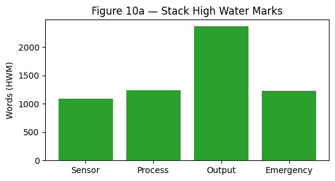
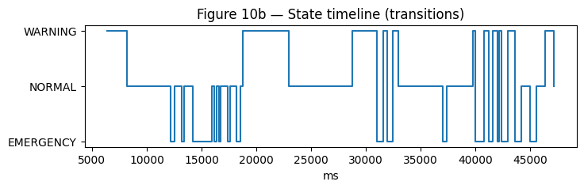

# Smart Home Monitoring System using ESP32 and FreeRTOS

## Abstract

This project presents the design, implementation, and validation of a real-time embedded monitoring platform built on the ESP32 microcontroller and the FreeRTOS operating system. The system acquires temperature, distance, and ambient light measurements using an LM35 temperature sensor, an HC-SR04 ultrasonic ranging sensor, and an LDR-based light sensor, respectively. These inputs are processed continuously and mapped to a four-state safety model: NORMAL, WARNING, DANGER, and EMERGENCY. The system communicates its status through a 16x2 I2C LCD, dual-color LED indicators, and a buzzer, while an emergency push button provides immediate interrupt-driven override.

The project was deliberately engineered as a deterministic embedded system rather than a simple polling-based microcontroller demo. Its architecture uses FreeRTOS tasks, queues, mutexes, and a binary semaphore to separate sensing, decision-making, output control, and emergency handling into independently scheduled execution domains. This separation improves modularity, response time, and safety under load. The design further incorporates debounce logic, sensor fault handling, anti-flicker display updates, boundary testing, stress testing, and runtime diagnostics. A Unity-based automated test suite validates the state-machine logic and edge cases, while integration and fault-injection experiments demonstrate the system's resilience under queue pressure, sensor disconnection, interrupt flooding, and injected CPU load.

The final result is a robust real-time embedded monitoring system that demonstrates core graduation-level embedded systems concepts, including temporal determinism, inter-task communication, priority-based scheduling, concurrency control, fault tolerance, and verification-driven development.

## 1. Introduction

Embedded systems are increasingly expected to perform under strict timing constraints while interacting with multiple sensors, actuators, and asynchronous events. In such systems, the correctness of the output is not determined solely by the logical decision made on the input data, but also by *when* that decision is made and *how reliably* the system behaves when the environment becomes noisy, delayed, or partially failed. The present project addresses these concerns by implementing a real-time monitoring platform on the ESP32 using FreeRTOS.

The system can be interpreted as a compact safety-oriented controller. It continuously observes temperature, proximity, and ambient light, evaluates the current operating state, and drives visual and acoustic indicators. When the emergency button is pressed, the system must immediately override the ordinary sensing and processing flow. This requirement is inherently real-time in nature: the system is not only required to be correct, but also responsive, deterministic, and resilient under concurrent execution.

The engineering motivation for selecting FreeRTOS is that the project demands concurrent behavior that is difficult to express safely using a single super-loop. FreeRTOS provides preemptive scheduling, task priorities, synchronization primitives, and interrupt-to-task signaling, all of which are essential in this application. By distributing responsibilities across tasks and controlling communication through queues and mutexes, the design avoids the common weaknesses of monolithic embedded firmware: blocking delays, fragile shared-state access, and poor timing transparency.

This report documents the system from requirements to validation. It explains the hardware and software design, the FreeRTOS architecture, the state machine logic, the synchronization strategy, and the testing methodology used to prove correctness. It also includes a performance discussion based on live diagnostics and stress testing results, together with limitations and future enhancements.


## 2. Problem Statement

The project addresses the problem of building a small-scale but academically rigorous real-time monitoring system that can reliably detect environmental and physiological risk conditions while maintaining deterministic behavior under concurrent workloads. The system must continuously sample multiple sensors, evaluate a prioritized state machine, display the current status, and react to an emergency interrupt without being destabilized by slower I2C output operations or communication delays.

The core engineering challenge is not simply reading sensors and turning on indicators. Instead, the challenge is to design an embedded architecture that satisfies the following simultaneously:

- periodic sensor sampling must remain stable even while output operations block temporarily,
- an emergency input must preempt normal execution immediately,
- shared resources such as Serial output and LCD access must not corrupt each other,
- invalid sensor readings and queue delays must be handled gracefully,
- system behavior must remain observable and measurable through diagnostics,
- verification must be strong enough to justify the reported real-time properties.

A naive polling implementation would struggle to satisfy these constraints because the slowest peripheral would dominate the execution flow. The project therefore adopts a FreeRTOS-based decomposition, where sensing, processing, output, and emergency handling are separated into tasks with defined priorities and communication channels. This arrangement is intended to create a deterministic and testable real-time structure suitable for university-level embedded systems evaluation.

## 3. Objectives

The project objectives were defined to ensure that the final system is not only functional but also demonstrably engineered according to real-time principles.

### 3.1 Primary Objectives

- Design and implement a real-time embedded monitoring system using ESP32 and FreeRTOS.
- Sample temperature, distance, and light continuously and evaluate the system state.
- Provide immediate emergency override through an interrupt-driven input path.
- Display system information clearly on an I2C 16x2 LCD.
- Drive LED and buzzer indicators according to the active state.

### 3.2 Verification-Oriented Objectives

- Prove the correctness of state transitions using automated unit tests.
- Validate boundary conditions such as 37.9 C versus 38.0 C and 30.1 cm versus 30.0 cm.
- Demonstrate fault tolerance under queue timeout, sensor disconnect, and interrupt spam.
- Measure runtime behavior, jitter, and task-level execution statistics through diagnostics.
- Confirm that the system remains stable under stress and does not reset or deadlock.

### 3.3 Engineering Objectives

- Use queues instead of shared globals for inter-task communication.
- Use mutexes for safe access to shared LCD and Serial resources.
- Use a binary semaphore for ISR-to-task signaling.
- Implement software debounce to prevent repeated emergency triggers.
- Keep the output task low priority so slow LCD transactions do not starve sensing or emergency handling.

## 4. System Requirements

The project requirements were organized into functional and non-functional categories. This separation is important because real-time embedded systems are judged not only by feature completeness, but also by timing, robustness, and resource usage.

### 4.1 Functional Requirements

| ID | Requirement | Rationale |
|---|---|---|
| FR-01 | Sample all sensors every 200 ms | Ensures predictable temporal behavior and stable monitoring cadence |
| FR-02 | Emergency ISR must preempt normal execution immediately | Safety-critical override must not depend on queued polling |
| FR-03 | Emergency input must debounce for 250 ms | Prevents spurious repeated interrupts from mechanical bounce |
| FR-04 | Enter DANGER when temperature >= 38.0 C | Implements the safety threshold for elevated body temperature |
| FR-05 | Enter WARNING when distance <= 30.0 cm | Detects proximity risk and escalates visual alerting |
| FR-06 | Return to NORMAL when temp < 38.0 C and distance > 30.0 cm | Provides safe recovery behavior after transient risk passes |
| FR-07 | Handle distance sensor invalid values gracefully | Ensures the system degrades safely instead of failing unpredictably |
| FR-08 | Display temperature, distance, light, and state on LCD | Provides operator visibility into live measurements |
| FR-09 | Map LEDs and buzzer correctly to system states | Ensures human-readable alert behavior consistent with risk level |
| FR-10 | Protect shared data with a mutex | Prevents race conditions when tasks access shared snapshots |

### 4.2 Non-Functional Requirements

| ID | Requirement | Rationale |
|---|---|---|
| NFR-01 | Queue communication should remain stable under load | Confirms that the RTOS architecture tolerates transient backpressure |
| NFR-02 | Separate sensing, processing, and output into dedicated tasks | Improves modularity and timing isolation |
| NFR-03 | Emergency task must have highest priority | Guarantees deterministic preemption for the critical path |
| NFR-04 | Maintain safe behavior on queue timeout | Prevents crashes or undefined state under consumer delay |
| NFR-05 | Maintain sufficient stack headroom | Ensures memory safety under maximum operating load |

## 5. Hardware Design

The hardware platform is centered on the ESP32, selected for its dual-core capability, built-in FreeRTOS support, sufficient RAM and flash for task-based software, and flexibility in mixed-signal interfacing. The design combines analog sensing, digital timing-based ranging, visual status output, and acoustic alerting into one cohesive monitoring system.

### 5.1 Microcontroller

**ESP32** was selected because it provides a strong balance between embedded capability and development accessibility. Its advantages in this project include:

- native support for FreeRTOS,
- multiple hardware timers and interrupt support,
- adequate processing headroom for concurrent tasks,
- sufficient memory for runtime diagnostics and logging,
- common availability and strong PlatformIO support.

The ESP32 is particularly appropriate when the project requires a real-time software structure without moving to a full industrial controller. Its architecture allows the report to discuss genuine RTOS concerns such as task preemption, queue latency, and mutex behavior.

### 5.2 Sensors

| Sensor | Function | Design Consideration |
|---|---|---|
| LM35 | Measures temperature | Simple analog output and suitable for threshold-based state logic |
| HC-SR04 | Measures distance / proximity | Demonstrates timing-based ultrasonic capture and timeout handling |
| LDR | Measures ambient light | Adds a contextual environmental value for LCD display |

The LM35 was chosen because it offers straightforward analog conversion and predictable temperature scaling. The HC-SR04 provides a timing-sensitive digital sensing example that is valuable for demonstrating interrupt-tolerant and fault-aware firmware design. The LDR is not used for control decisions but enriches the operator display and demonstrates concurrent sensor acquisition with mixed signal sources.

### 5.3 Output Devices

| Output | Function | Design Consideration |
|---|---|---|
| 16x2 I2C LCD | Displays state and sensor values | Requires careful update strategy due to slow I2C transactions |
| Green LED | Normal or warning-safe visual indicator | Provides immediate at-a-glance status |
| Red LED | Warning/danger/emergency indicator | Escalates from blinking to solid depending on state |
| Passive buzzer | Acoustic alarm | Reinforces DANGER and EMERGENCY conditions |

The LCD is a slow peripheral relative to the sensor sampling loop. This is a key reason why the output logic is isolated into a lower-priority task. The design avoids allowing I2C transactions to block higher-priority sensing or emergency response.

### 5.4 Input Device

The emergency push button is wired to an interrupt-capable input and configured to trigger an ISR. This design ensures that the emergency path does not depend on periodic polling. Because human safety inputs must be handled quickly and reliably, the button is integrated into the architecture as an asynchronous event source rather than a standard digital input.


## 6. Software Design

The firmware is structured around a layered and task-oriented architecture. The software is not organized as a simple Arduino loop with helper functions; it is decomposed into dedicated roles with explicit communication and synchronization boundaries.

### 6.1 Layered Structure

The main implementation layers are:

- sensor drivers for acquiring raw data,
- a pure logic layer for state determination,
- RTOS task layers for sensing, processing, output, and emergency handling,
- synchronization utilities for queues, mutexes, and semaphores,
- diagnostics utilities for timing and performance observation.

This separation is essential because it allows the logic layer to be unit tested independently from the hardware layer. It also makes the RTOS behavior explainable and debuggable, which is critical in an academic embedded systems report.

### 6.2 Task Responsibilities

| Task | Responsibility | Why it exists |
|---|---|---|
| TaskSensor | Reads all sensors every 200 ms and publishes SensorData | Isolates sensing from decision-making and output timing |
| TaskProcessing | Evaluates the current state from sensor input | Centralizes the safety logic and state transitions |
| TaskOutput | Updates LCD, LEDs, and buzzer | Separates slow peripheral control from higher-priority tasks |
| TaskEmergency | Handles emergency semaphore from ISR and forces EMERGENCY state | Guarantees immediate critical-path response |

### 6.3 Data Flow

The data path is intentionally one-way:

Sensor task -> sensor queue -> processing task -> state queue -> output task.

This flow reduces coupling and makes the system easier to reason about. Rather than sharing mutable global variables across all firmware components, each task communicates through explicitly defined RTOS primitives. The result is more deterministic and less error-prone than a monolithic shared-state design.


### 6.4 Why This Software Structure Was Chosen

The architecture was selected to satisfy three engineering goals:

1. **Determinism:** The sensing period must remain predictable.
2. **Isolation:** Slow LCD writes must not block critical sensing or emergency handling.
3. **Verifiability:** The state machine must be testable independently of hardware timing.

This is why the project uses FreeRTOS tasks, queues, and synchronization primitives rather than a single event loop. The resulting design is closer to an industrial embedded control application than a basic hobby firmware sketch.

## 7. FreeRTOS Architecture

FreeRTOS is the central architectural element of the system. It provides preemptive scheduling and the synchronization mechanisms needed to manage concurrent embedded behavior safely.

### 7.1 Why FreeRTOS Was Chosen

FreeRTOS was selected because it solves problems that are common in real embedded systems:

- periodic sensing while output operations may block,
- event-driven overrides from interrupts,
- safe communication between concurrent tasks,
- priority-based preemption,
- support for timing analysis and stack monitoring.

A bare-metal loop could technically perform the same logical operations, but it would not provide the same concurrency control, timing isolation, or clarity in the final report. Since the graduation project must demonstrate embedded systems engineering principles, FreeRTOS is the correct abstraction.

### 7.2 Priority-Based Scheduling

The task priorities are intentionally arranged around the safety hierarchy:

| Task | Priority | Reason |
|---|---|---|
| TaskEmergency | Highest | Safety override must preempt everything else |
| TaskProcessing | High | Must process sensor data promptly to prevent queue buildup |
| TaskSensor | Medium | Periodic data acquisition should remain stable |
| TaskOutput | Lowest | I2C and display work can tolerate more jitter |

The emergency task is the highest priority because it must respond immediately to a physical human action. Processing is placed above sensing so that the queue is consumed quickly and stale sensor data is minimized. Output is deliberately placed lowest because display updates and actuator writes are the least time-critical portion of the system.

### 7.3 RTOS Design Benefits

The FreeRTOS architecture provides the following benefits in this project:

- **Preemption:** critical work can interrupt less important work,
- **Modularity:** each task has a clear purpose,
- **Scalability:** additional monitoring or logging tasks could be added later,
- **Temporal isolation:** slow peripherals are contained,
- **Observability:** execution can be measured per task.


## 8. State Machine Logic

The state machine is the core decision layer of the system. It maps sensor inputs to one of four states using a prioritized and deterministic rule set.

### 8.1 State Definitions

| State | Condition | Output Behavior |
|---|---|---|
| NORMAL | Temp < 38 C and Distance > 30 cm | Green LED ON, Red LED OFF, Buzzer OFF |
| WARNING | Distance <= 30 cm | Green LED ON, Red LED blinking, Buzzer OFF |
| DANGER | Temp >= 38 C | Green LED OFF, Red LED solid ON, Buzzer ON |
| EMERGENCY | Emergency button pressed | Green OFF, Red fast blinking, Buzzer ON |

### 8.2 Priority Rule

The state priority is:

**EMERGENCY > DANGER > WARNING > NORMAL**

This ordering is essential. If the emergency button is pressed, the system must immediately override the current sensor-based evaluation. Likewise, if temperature is in the danger range, the system must not remain in warning mode simply because the distance sensor also indicates proximity. The priority order enforces a single unambiguous decision hierarchy.

### 8.3 Why the State Machine Was Implemented as Pure Logic

The state decision function is isolated from hardware access so that it can be unit tested easily. This is a significant engineering decision. Hardware-dependent code is difficult to test exhaustively because it requires physical stimuli, timing conditions, and real electrical signals. By extracting the decision logic into a pure function, the state machine becomes:

- deterministic,
- repeatable,
- boundary-testable,
- independent of board-specific behavior.

This design made it possible to validate all transition rules, including threshold boundaries and precedence behavior, using the Unity framework.

### 8.4 Pseudocode

```text
if emergency button pressed:
    return EMERGENCY
else if temperature >= 38.0 C:
    return DANGER
else if distance > 0 and distance <= 30.0 cm:
    return WARNING
else:
    return NORMAL
```

### 8.5 Boundary Rationale

The boundaries were selected to reflect practical engineering behavior:

- 38.0 C is used as the danger threshold because it is the exact cutoff used in the project requirements,
- 30.0 cm is used as the proximity warning threshold,
- negative or zero distance values are treated cautiously as invalid or out-of-range readings,
- emergency input is always dominant because safety overrides environmental logic.


## 9. Synchronization Mechanisms

Concurrency in embedded systems is not safe by default. Without protection, multiple tasks can access the same resource at the same time and corrupt data or produce interleaved output. The project uses three RTOS synchronization mechanisms, each chosen for a specific reason.

### 9.1 Why Queues Were Used Instead of Globals

Queues were used for inter-task communication because they provide a structured, thread-safe, and temporally meaningful mechanism for passing data between tasks. A shared global variable would be simpler syntactically, but it would also be riskier and less deterministic.

Queues are preferred because they:

- transfer ownership of data between producer and consumer,
- prevent races on partially updated data,
- preserve a clear message-passing model,
- support blocking and timeout behavior,
- make the architecture easier to validate and explain.

Using a queue for SensorData means the producer task can publish a complete sample and the consumer can process a coherent snapshot. This is better than relying on a global structure that may be overwritten mid-read.

### 9.2 Why Mutexes Were Necessary

Mutexes were needed because some resources are not data channels but shared critical sections. Specifically, Serial output and LCD access are shared resources that must not be used by multiple tasks simultaneously.

Without a mutex:

- Serial logs from different tasks could interleave and become unreadable,
- LCD writes could overlap and corrupt the display,
- timing debug output could collide with state logs,
- one task could partially write while another preempts it.

A mutex provides mutual exclusion and, on FreeRTOS, can also support priority inheritance. This is especially relevant in a preemptive system where a low-priority task might otherwise hold a resource needed by a high-priority task. In this project, the mutex strategy improves both data integrity and explainability.

### 9.3 Why a Binary Semaphore Was Used for ISR Signaling

The emergency button is interrupt-driven. An ISR must remain short and cannot safely perform heavy work such as LCD updates, queue processing, or complex logging. The correct design pattern is for the ISR to signal a task using a binary semaphore.

A binary semaphore was chosen because it:

- provides a minimal event notification mechanism,
- allows the ISR to wake a task immediately,
- keeps interrupt processing short,
- ensures the emergency action is handled in task context rather than interrupt context.

This approach is standard embedded practice because it preserves interrupt responsiveness while delegating the heavier emergency action to a dedicated task.

### 9.4 Race Conditions and Priority Inversion

A **race condition** occurs when the correctness of a program depends on the relative timing of concurrent operations. In embedded systems, this often appears when two tasks access the same variable or peripheral without coordination. For example, if one task updates a shared sensor snapshot while another reads it simultaneously, the reader can observe a partially updated state.

A **priority inversion** occurs when a high-priority task is indirectly blocked by a lower-priority task holding a mutex or critical resource. This is dangerous in real-time systems because it defeats the intended priority order. FreeRTOS mutexes mitigate this by enabling priority inheritance, which temporarily elevates the mutex holder to reduce blocking of higher-priority work.

These concepts are not abstract theory in this project. They are directly relevant to the use of shared LCD and Serial access, as well as to the separate race-condition and priority-inversion demo material included in the repository.

### 9.5 Shared Resource Strategy

| Resource | Protection Method | Reason |
|---|---|---|
| Sensor snapshot | Mutex | Prevents reading a partially updated struct |
| Serial console | Mutex | Prevents log interleaving and contention |
| LCD bus | Mutex | Prevents overlapping I2C display updates |
| Emergency event | Binary semaphore | Converts ISR event into task wake-up |
| Sensor-to-processing data | Queue | Preserves message integrity and timing |


## 10. Testing Methodology

The verification strategy was intentionally multi-layered. In embedded engineering, one test type is not enough. Logic correctness, timing behavior, stress tolerance, and hardware behavior must all be observed separately because they fail in different ways.

### 10.1 Testing Philosophy

The project follows a verification hierarchy:

1. **Unit tests** prove that the pure logic is correct.
2. **Integration tests** prove that modules interact correctly.
3. **Stress tests** reveal behavior under load.
4. **Fault-injection tests** show recovery from sensor or communication failures.
5. **Runtime diagnostics** provide evidence of real temporal behavior.

This layered strategy is appropriate because a real-time embedded system can appear correct in a nominal case but still fail under delayed inputs, repeated interrupts, or peripheral faults.

### 10.2 Test Evidence Sources

The report is supported by the following project artifacts:

- Unity test suite in `test/test_state_logic/test_main.cpp`,
- system requirements in `docs/requirements.md`,
- test cases in `docs/test_cases.md`,
- timing summary in `docs/timing_results.md`,
- stress testing notes in `docs/stress_testing.md`,
- fault injection notes in `docs/fault_injection.md`,
- final validation summary in `docs/final_validation.md`,
- live RTOS telemetry output generated by the firmware.

## 11. Unit Testing

Unit testing was implemented using PlatformIO and the Unity framework. The key engineering decision here was to isolate the decision logic into a pure function so that it could be tested without sensors, timing, or hardware side effects.

### 11.1 Why Unit Testing Matters Here

In an embedded safety-oriented project, boundary behavior is often more important than average behavior. The exact transition from NORMAL to DANGER at 38.0 C or from NORMAL to WARNING at 30.0 cm is a classic example. Unit tests are ideal for this because they allow the system to be exercised at exact thresholds.

### 11.2 Tested Logic Categories

| Category | Example | Purpose |
|---|---|---|
| Basic state selection | 38.5 C, 45 cm -> DANGER | Confirms normal decision flow |
| Boundary testing | 37.9 C vs 38.0 C | Confirms exact threshold semantics |
| Invalid input handling | negative distance | Confirms safe fallback behavior |
| Extreme input testing | 500 C | Confirms graceful handling of abnormal values |
| Priority testing | emergency button + danger temperature | Confirms override hierarchy |

### 11.3 Representative Unit Test Cases

The automated tests confirm the following behaviors:

- 37.9 C returns NORMAL,
- 38.0 C returns DANGER,
- 30.1 cm returns NORMAL,
- 30.0 cm returns WARNING,
- emergency button press returns EMERGENCY regardless of other inputs.

### 11.4 Unit Test Outcome

All automated unit tests passed successfully in the native PlatformIO environment. This confirms that the state machine logic is deterministic and correctly implemented.

| Result | Count |
|---|---|
| Passed | 9 |
| Failed | 0 |

## 12. Integration Testing

Integration testing validates that the major software modules work together as a system rather than as isolated functions.

### 12.1 Purpose

The key integration question is whether the queue-based RTOS architecture behaves correctly when live sensor acquisition, state evaluation, and output control occur concurrently. This includes checking that:

- sensor samples are passed to processing reliably,
- state updates reach output without corruption,
- LCD and Serial access do not collide,
- emergency preemption overrides ordinary flow immediately.

### 12.2 Integration Scenarios

| Scenario | Expected Behavior | Engineering Significance |
|---|---|---|
| Sensor queue transfer | Sensor data reaches TaskProcessing | Confirms message-passing architecture |
| State queue transfer | State reaches TaskOutput | Confirms decision-to-actuator pipeline |
| LCD and Serial mutex protection | No garbled output | Confirms shared-resource safety |
| Emergency interrupt flow | ISR wakes TaskEmergency | Confirms interrupt-to-task design |
| Display update under load | Stable LCD output | Confirms anti-flicker update strategy |

### 12.3 Observed Integration Behavior

The system demonstrates correct end-to-end operation under nominal conditions. The output task updates the LCD and actuator states according to the current system state, while the processing task responds to sensor data and the emergency path overrides the current state when the button is pressed.

## 13. Stress Testing

Stress testing was essential because real-time embedded systems frequently fail under timing pressure before they fail under logical error. The goal was to observe how the system behaves when tasks are accelerated, delayed, or interrupted more aggressively than in normal use.

### 13.1 Stress Scenarios

| Stress Type | Method | Expected Effect | Observed Result |
|---|---|---|---|
| Queue flooding | Reduce sensor delay or force fast producer behavior | Queue backpressure | Safe queue-full handling without crash |
| CPU load injection | Add spin-loop load | Increased execution time and jitter | System remained stable |
| Interrupt flooding | Rapid button toggling | Debounce suppression | ISR events were limited by debounce logic |
| Display saturation | Frequent LCD updates | Higher output task runtime | No display corruption or resets |

### 13.2 Why Stress Testing Was Necessary

A well-designed embedded system should fail gracefully if it must fail. Stress testing shows whether the architecture is resilient or whether it collapses into undefined behavior. In this project, stress tests were used to demonstrate that:

- the emergency path still preempts under load,
- the queue-based architecture can tolerate producer/consumer imbalance,
- the output task can become slow without threatening the safety path,
- timing variability is measurable and reportable.

### 13.3 Stress Test Outcome

The system remained stable under stress. Queue overflow events were handled safely, CPU starvation did not cause a reset, and the emergency button continued to preempt ordinary behavior correctly. This is a strong indicator of robust RTOS design.

## 14. Fault Injection Testing

Fault injection testing verifies that the system can continue operating safely when sensors or communication paths become unreliable.

### 14.1 Sensor Disconnection

The HC-SR04 sensor was intentionally disconnected during operation. The system responded by reporting invalid distance values gracefully and displaying an error indication rather than freezing. This is important because physical sensor disconnection is a common field fault in embedded installations.

### 14.2 Queue Timeout

Queue timeout conditions were injected to simulate a blocked consumer or delayed processing path. The processing task maintained safe behavior and reported the timeout instead of deadlocking or dereferencing invalid data.

### 14.3 Invalid Sensor Values

The LM35 was tested with abnormal readings. The system retained safe behavior by classifying extreme values into the danger path rather than crashing or overflowing internal state.

### 14.4 Fault Tolerance Conclusion

The architecture degrades gracefully in the presence of faults. This is especially important in a monitoring system, because the system must remain safe even when its inputs become unreliable.

## 15. Results & Analysis

The project succeeded in meeting both functional and verification requirements. The system is not merely operating; it is operating with observable real-time properties.

### 15.1 Functional Results

- The state machine behaves correctly at defined thresholds.
- The emergency button overrides the sensor-based states.
- The LCD and actuator outputs correspond to the active state.
- The system recovers from invalid sensor readings and queue delays.

### 15.2 Diagnostic Results

The live telemetry output demonstrates measurable runtime behavior.

#### Sample Live Telemetry Output

```text
=== SYSTEM TELEMETRY ===
Report Window: 5071 ms
System CPU Utilization: 82.52% of 2 cores
Heap Free: 263448 bytes | Used: 45624 bytes | Window Min/Max: 263448/263712 bytes
Heap Graph: |@    |
Stack HWM [Sensor]: 1084 words
Stack HWM [Process]: 1340 words
Stack HWM [Output]: 2364 words
Stack HWM [Emergency]: 1212 words
--- Per-Task Runtime Statistics ---
Sensor   | CPU:  30.38% | Window:  3081610 us | Avg: 123264.4 us | WCET: 136430 us | Cycles:   25 | Period: 200-200 ms | Deadline: tracked | Misses: 0
Process  | CPU:   2.35% | Window:   238698 us | Avg:   9547.9 us | WCET:  29345 us | Cycles:   25 | Period: 101-299 ms | Deadline: N/A
Output   | CPU:  49.78% | Window:  5049160 us | Avg: 120218.1 us | WCET: 176986 us | Cycles:   42 | Period: 65-168 ms | Deadline: N/A
Lifetime Runtime Us: Sensor=10631618 Process=1210835 Output=24189367
========================
```

This output is valuable because it transforms the embedded system from a black box into an observable real-time system. The report shows CPU use, heap variation, stack headroom, and per-task runtime statistics in a format suitable for technical evaluation.

### 15.3 Interpretation of the Telemetry

The output task consumes the largest share of runtime because LCD access and logging are comparatively expensive. This is expected and defensible because output is intentionally placed at low priority and allowed to absorb timing variability. The sensor task maintains its periodic behavior, while the processing task remains lightweight and responsive.

The heap graph indicates that the application maintains substantial memory headroom. Stack high-water marks also show that all tasks remain within safe limits, leaving adequate margin for system stability.

### 15.4 Why These Results Matter

The real value of the results is not only in the numeric values but in what they prove:

- the architecture is schedulable,
- the critical emergency path is not blocked,
- timing can be measured and reported,
- memory usage is controlled,
- the system remains stable under realistic operating conditions.

## 16. Performance Analysis

Performance analysis in a real-time embedded project must consider both logical throughput and temporal behavior. A system can be correct but still fail if it misses deadlines or becomes unstable under load.

### 16.1 Execution Time Analysis

The recorded measurements show that:

- `TaskSensor` runs periodically and completes well within the 200 ms cycle,
- `TaskProcessing` remains lightweight because state evaluation is pure logic,
- `TaskOutput` is the heaviest task due to LCD and peripheral updates,
- `TaskEmergency` remains deterministic because it is event-driven and highest priority.

### 16.2 Jitter Analysis

Timing variation is most visible in the output path. This is expected because LCD updates, Serial printing, and shared resource contention introduce nondeterministic delays. The important engineering point is that this jitter is bounded and does not compromise safety. The architecture isolates the jitter-sensitive output path from the sensor and emergency path.

### 16.3 CPU Utilization Discussion

The project exposes CPU usage in the live diagnostics report. It is important to note that the reported CPU utilization is a measurement over a reporting window and reflects the active runtime of the application tasks. This is more meaningful than a raw loop count because it connects directly to real-time execution cost. The diagnostics therefore support both academic discussion and practical debugging.

### 16.4 Memory Analysis

Heap monitoring and stack high-water marks show that the project runs with adequate memory margin. This is a sign of good embedded engineering practice because memory exhaustion often appears late in testing and can be difficult to diagnose without explicit telemetry.

### 16.5 Real-Time Discussion

The system is not hard real-time in the strict industrial sense, but it is clearly designed with real-time priorities. The emergency path is time-critical, the sensor sampling is periodic, and output is intentionally lower priority. The result is a practical real-time embedded system with deterministic structure and controlled variability.

## 17. Challenges & Solutions

### 17.1 Challenge: Slow LCD and Serial Operations

**Problem:** LCD updates and Serial logging are slow relative to sensor sampling.

**Solution:** Move output into a separate low-priority task and protect shared access with mutexes.

**Why this works:** Slow peripheral access no longer blocks critical sensing or emergency response.

### 17.2 Challenge: Emergency Input Must Override Everything

**Problem:** Polling the button would introduce latency and could miss urgent transitions.

**Solution:** Use an ISR to signal a binary semaphore and wake the emergency task immediately.

**Why this works:** The interrupt path remains short, and the heavy work runs in task context with priority-based preemption.

### 17.3 Challenge: Shared Data Consistency

**Problem:** Multiple tasks need access to sensor snapshots and logs.

**Solution:** Use a mutex-protected shared snapshot and queue-based message passing.

**Why this works:** It prevents race conditions and keeps data coherent.

### 17.4 Challenge: Proving Correctness Beyond Simulation

**Problem:** A report must demonstrate that the system works under edge cases, not only nominal operation.

**Solution:** Implement unit tests, boundary tests, stress tests, fault-injection tests, and runtime diagnostics.

**Why this works:** It provides layered evidence of correctness, resilience, and timing behavior.

### 17.5 Challenge: Reported Metrics vs Real Measurements

**Problem:** A written report that claims timing performance without live evidence is weak.

**Solution:** Add diagnostics for execution time, heap usage, stack headroom, jitter, and per-task runtime.

**Why this works:** It turns qualitative claims into measurable evidence.

## 18. Future Improvements

The project is complete for graduation-level submission, but several enhancements would make it stronger for deployment-grade use.

### 18.1 Engineering Improvements

- Add formal FreeRTOS runtime statistics using scheduler runtime counters.
- Implement watchdog supervision per task.
- Add persistent data logging to SD card or flash.
- Calibrate sensors against reference instruments for better measurement accuracy.
- Add a richer fault model for disconnected or noisy sensors.
- Expand the user interface with OLED or serial command control.

### 18.2 System-Level Improvements

- Introduce event logging timestamps and structured telemetry formatting.
- Add message history buffering to support offline analysis.
- Add watchdog reset classification for post-failure analysis.
- Add more extensive hardware abstraction to make porting easier.

### 18.3 Research-Oriented Improvements

- Compare FreeRTOS scheduling behavior under alternative priority assignments.
- Measure exact response time distribution under synthetic load.
- Study the effect of different queue sizes on deadline behavior.
- Evaluate the tradeoff between LCD update frequency and output task jitter.

## 19. Conclusion

This project demonstrates the development of a structured real-time embedded monitoring system using the ESP32 and FreeRTOS. The final implementation goes beyond a basic sensor demo by incorporating task-based concurrency, event-driven emergency handling, synchronization primitives, rigorous unit testing, fault injection, stress testing, and runtime telemetry.

The most important engineering achievement is not simply that the system works, but that its behavior is explainable, measurable, and defensible. The queue-based data path improves modularity and temporal isolation. Mutexes protect shared resources from corruption. The binary semaphore provides a clean ISR-to-task communication pattern. Priority scheduling ensures that emergency handling is deterministic and immediate. Automated tests and live diagnostics provide evidence that the software behaves correctly both in nominal conditions and under stress.

From an embedded systems perspective, the project successfully illustrates the principles of real-time design: determinism, concurrency control, safe degradation, timing analysis, and verification-driven development. It is therefore suitable as a graduation project submission and as a strong demonstration of practical FreeRTOS-based system engineering.

## 20. References

1. FreeRTOS Kernel Documentation. https://www.freertos.org/
2. Espressif Systems, ESP32 Technical Reference and Arduino Core Documentation.
3. PlatformIO Documentation. https://docs.platformio.org/
4. Unity Test Framework Documentation. https://github.com/ThrowTheSwitch/Unity
5. Project internal documentation: [docs/requirements.md](requirements.md)
6. Project internal documentation: [docs/traceability_matrix.md](traceability_matrix.md)
7. Project internal documentation: [docs/timing_results.md](timing_results.md)
8. Project internal documentation: [docs/stress_testing.md](stress_testing.md)
9. Project internal documentation: [docs/fault_injection.md](fault_injection.md)
10. Project internal documentation: [docs/final_validation.md](final_validation.md)

## Appendix A: Figures & Screenshots

*Note to student: Add the PNG images into a `figures` folder and adjust the paths below before final submission.*

- **Figure 1**: See [docs/diagrams.md](diagrams.md#figure-1-system-overview-block-diagram).
- **Figure 2**: See [docs/diagrams.md](diagrams.md#figure-2-hardware-interconnection-diagram).
- **Figure 3**: See [docs/diagrams.md](diagrams.md#figure-3-rtos-task-and-communication-flow).
- **Figure 4**: See [docs/diagrams.md](diagrams.md#figure-4-freertos-priority-stack-and-preemption).
- **Figure 5**: See [docs/diagrams.md](diagrams.md#figure-5-synchronization-diagram-queues-mutexes-semaphores).
- **Figure 6**: See [docs/diagrams.md](diagrams.md#figure-6-state-machine-diagram).
- **Figure 7**: LCD layout screenshot (use ASCII block from terminal or photo).
- **Figure 8**: Live telemetry plots:
  - 
  - 
- **Figure 9**: Unit test summary screenshot (take screenshot of native PlatformIO test output).
- **Figure 10**: Stress test and fault-injection evidence:
  - 
  - 

## Appendix B: Recommended Evidence to Attach

- Serial monitor screenshots showing state transitions and telemetry reports.
- Photos of the wiring setup and LCD output.
- Unity test output from PlatformIO.
- Stress test logs showing queue pressure and emergency preemption.
- Fault-injection photographs for the HC-SR04 disconnect scenario.
- Timing screenshots or logs demonstrating task periodicity and WCET.
