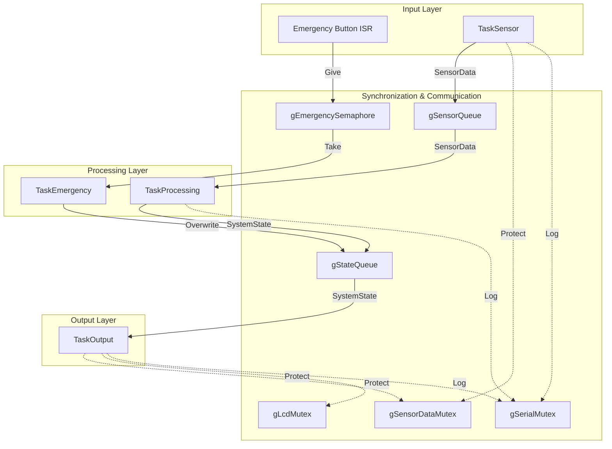
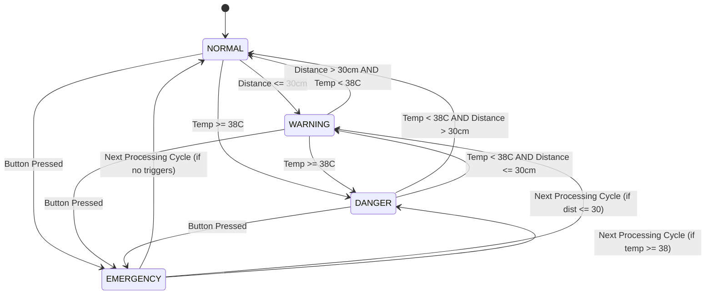
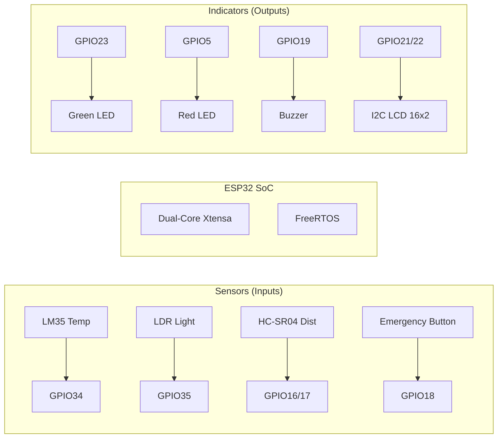

# Architecture Diagrams

This document provides visual representations of the Smart Patient Monitoring System's architecture, including RTOS task flows, synchronization primitives, and state transitions.

## 1. RTOS Task & Communication Flow
The system uses a pipelined architecture where data flows from sensors to processing, and finally to outputs, with a high-priority emergency path.

## 2. System State Machine
The system transitions between four states based on sensor thresholds and user interrupts.

## 3. Hardware Architecture
A simplified block diagram showing the connections to the ESP32.

