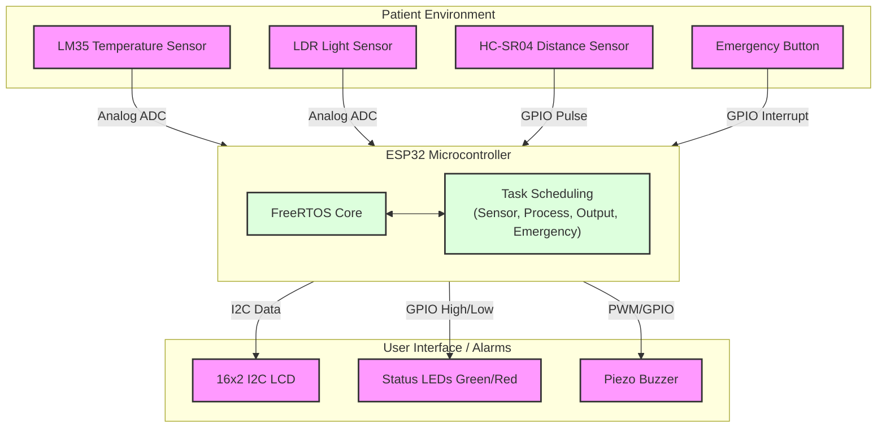
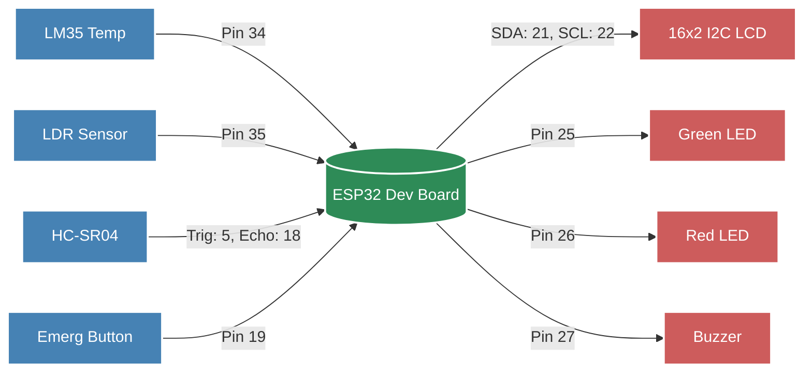
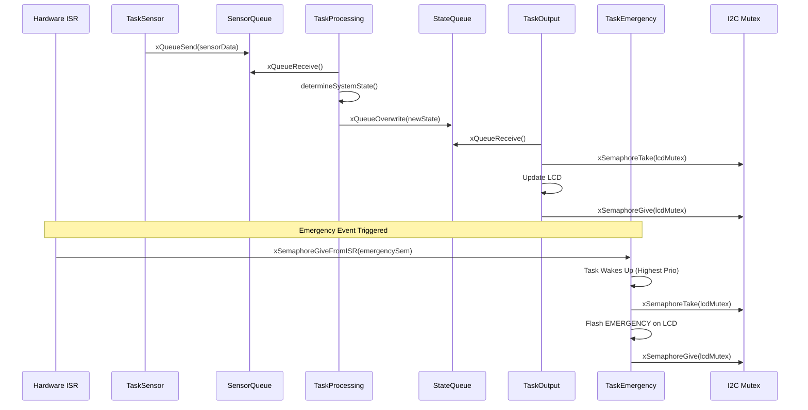
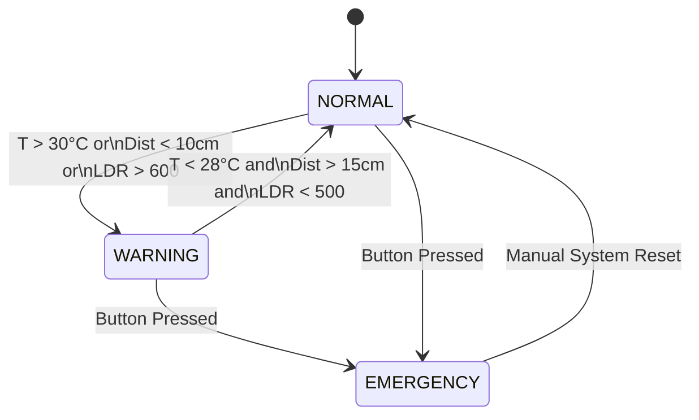

# Smart Patient Monitor - System Diagrams

You can view these diagrams directly in VS Code by installing the **Mermaid Preview** extension, or copy-pasting them into [Mermaid Live Editor](https://mermaid.live).

## Figure 1: System Overview Block Diagram


## Figure 2: Hardware Interconnection Diagram


## Figure 3: RTOS Task and Communication Flow
```mermaid
graph TD
    %% Styles
    classDef task fill:#9370DB,stroke:#fff,stroke-width:2px,color:#fff;
    classDef queue fill:#FFA500,stroke:#fff,stroke-width:2px,color:#fff,shape:cylinder;
    classDef isr fill:#FF4500,stroke:#fff,stroke-width:2px,color:#fff;

    ISR((Button ISR)):::isr

    subgraph "FreeRTOS Tasks"
        TS[Task: Sensor\nPriority: 2]:::task
        TP[Task: Processing\nPriority: 3]:::task
        TO[Task: Output\nPriority: 1]:::task
        TE[Task: Emergency\nPriority: 4]:::task
    end

    Q_SENS[(SensorQueue\nCapacity: 10)]:::queue
    Q_STATE[(StateQueue\nCapacity: 1)]:::queue
    SEM>Emergency Semaphore]:::queue

    ISR -.->|Give| SEM
    SEM -.->|Take| TE

    TS -->|Send Data\n(Overwrites if full)| Q_SENS
    Q_SENS -->|Receive Data| TP

    TP -->|Compute & Send State\n(Overwrite)| Q_STATE
    Q_STATE -->|Receive State| TO

    TE -->|Preempts All| TP
```

## Figure 4: FreeRTOS Priority Stack and Preemption
```mermaid
gantt
    title Task Execution Timeline & Preemption
    dateFormat  s
    axisFormat  %S
    
    section Output (Prio 1)
    Updating LCD         :a1, 0, 3s
    
    section Sensor (Prio 2)
    Sampling Sensors     :a2, 1, 1s
    
    section Processing (Prio 3)
    Calculating State    :a3, 1.5, 0.5s
    
    section Emergency (Prio 4)
    Handling Interrupt   :crit, a4, 2s, 0.5s
```

## Figure 5: Synchronization Diagram (Queues, Mutexes, Semaphores)


## Figure 6: State Machine Diagram

